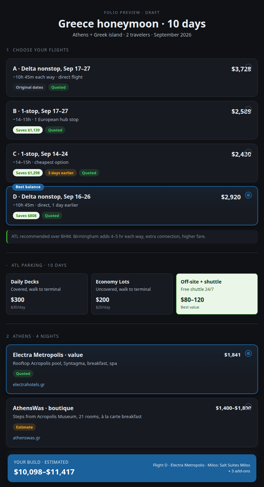

# Case study: Voygent's Folio Board

The Pizza Builder in this repo is an example. This is the production MCP App it was distilled from, which runs in claude.ai (web + Desktop) today.

[Voygent](https://voygent.ai) is an MCP server for travel advisors. An advisor plans a trip in chat; the deliverable is a **Folio** (the client-facing itinerary). The **Folio Board** is that Folio rendered as an interactive whole-trip widget inside the chat: every flight/hotel/tour option laid out as a compare-and-pick board, with a live running budget, that the advisor curates and then hands back to the model.

> A 10-day Greece honeymoon: numbered decision groups (flights A–D with a "Best balance" badge, the selected option lit up), inline parking compare-cards, hotel options with price ranges, and the sticky **YOUR BUILD · ESTIMATED $10,098–$11,417** bar that recomputes as you pick. This is one tool call.

## Same patterns, bigger domain

Every pattern in this repo maps 1:1 to something the Folio Board ships:

| This repo (Pizza Builder) | Folio Board (production) |
|---|---|
| `build_pizza` returns `{orderId}` | `preview_folio_board` returns `{__voygentFolioBoardRef:{tripId,rev}}` |
| `pizza_state` (app-only) fetches the menu | `folio_board_data` (app-only) fetches the trip projection |
| `pizza_pick` toggles a topping | `folio_board_pick` selects a flight/hotel/tour option |
| *Place order* → `updateModelContext` + `sendMessage` | *"Done — apply my picks"* → same two calls |
| hero image via CSP | trip hero image via `_meta.ui.csp.resourceDomains` (`*.voygent.ai`) |
| download a receipt | export the itinerary to `.ics` via `downloadFile` |
| inline/fullscreen toggle | same, gated on `availableDisplayModes` |

## The numbers that justified it

The Folio Board is why the [token-economy pattern](docs/06-token-economy.md) exists. A rich trip projection is **~9,155 tokens**. Returning that from the launcher tool would dump it into the model's context on every preview. With the ref-and-fetch split, the model-visible payload is **~132 tokens**; the widget fetches the full projection itself over the bridge. That is a **~98.5%** reduction, which makes a meaningful cost difference when the board is opened repeatedly across a session.

## What production added on top

Things the toy omits but the real board needed:

- **Advisor vs. client views**: a server-side firewall strips advisor-only fields (margins, internal notes, soft-PII) before the client-facing projection is built. The widget never has data it shouldn't show.
- **Inline editing**: `folio_board_text` lets the advisor edit day notes, the trip summary, and budget notes in place; `folio_board_extra` curates "good to know" sections. All app-only, silent writes (no model turn) with an optimistic concurrency guard (`rev`).
- **Content-versioned resource URI**: the most important production lesson (see [gotcha G1](docs/08-gotchas.md)). claude.ai caches `ui://` resources by URI and won't refetch on reconnect, so the URI embeds a hash of the widget bundle. Ship a new widget, the URI changes, and the host fetches it. (Web still needs a fresh chat; Desktop refetches.)
- **Stale-replay guard**: if the host replays an old tool result, the widget detects the stale timestamp and does one read-only refetch instead of rendering stale state.

## What we learned

The [gotchas doc](docs/08-gotchas.md) covers the full list. Key findings:

- `updateModelContext` is **silent**. It stages state for the model's next turn and does not trigger one. Capabilities live on `getHostCapabilities()`, not `getHostContext()`. Mixing those two up is an easy mistake that produces no error, just a silent false.
- `sendMessage` on claude.ai web pops a red "use caution" banner every time, regardless of wording. It's host safety UX and cannot be suppressed. Design the flow around it.
- The tool catalog is **locked per session**. Register a new tool and existing sessions won't see it until they reconnect.
- There is **no `progressToken`** from claude.ai. MCP progress notifications never arrive. The only real-time feedback channel is the model narrating in the chat thread.

None of these are in the spec.
