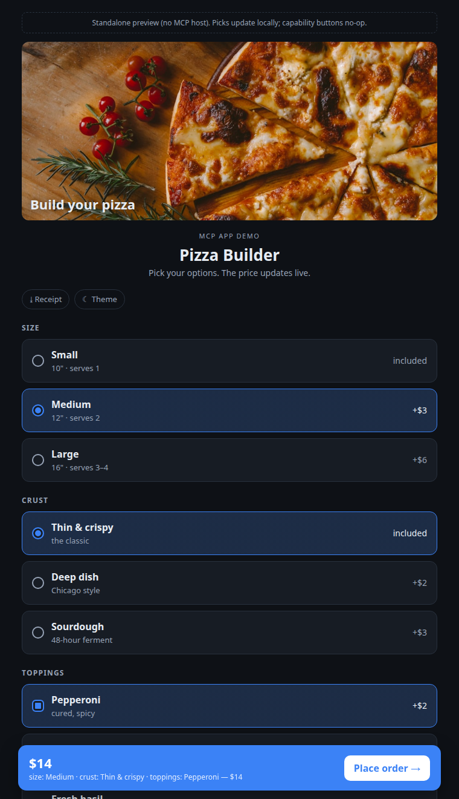
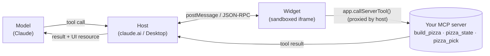

# mcp-apps-interactive-ui

A runnable example of building interactive in-chat UI with [MCP Apps](https://github.com/modelcontextprotocol/ext-apps), with docs on the parts that aren't obvious from the spec.

MCP Apps (the `io.modelcontextprotocol/ui` extension, SEP-1865) lets an MCP server hand the host a sandboxed HTML widget instead of plain text. The model calls one tool and the user gets a real interface: option pickers, live totals, buttons that talk back to the model. This repo is a minimal working example of that pattern.



*Static screenshot, not a live embed. To run the real thing: build the repo and open `dist/builder.html` in a browser, or connect the server to a host (see [Quickstart](#quickstart)).*

The example app is a Pizza Builder. Pick size, crust, and toppings, watch the price update live, and hit *Place order* to hand the choice back to the model. The domain is intentionally simple so the MCP Apps mechanics stay in focus.

## Requirements

Node.js 20.11 or newer (the code uses `import.meta.dirname`, and `@modelcontextprotocol/ext-apps` requires Node 20+).

## What it demonstrates

In about 350 lines of commented source:

| Capability | How | Where |
|---|---|---|
| Render an interactive widget from a tool call | `_meta.ui.resourceUri` links a tool to a `ui://` resource | [`src/server.ts`](src/server.ts), [docs/02](docs/02-ui-resources.md) |
| Keep the model's context small | launcher returns a `{orderId}` ref; the widget fetches the rest via an app-only tool | [docs/06](docs/06-token-economy.md) |
| Let the user pick options without spending tokens | `visibility: ["app"]` tools the model never sees | [`src/server.ts`](src/server.ts) |
| Hand a result back to the model | `updateModelContext` (stage) then `sendMessage` (trigger) | [docs/05](docs/05-two-way-comms.md) |
| Show external images | `_meta.ui.csp.resourceDomains` | [docs/04](docs/04-csp-and-imagery.md) |
| Download a file | `app.downloadFile` | [`src/widget/widget.ts`](src/widget/widget.ts) |
| Go fullscreen | `app.requestDisplayMode` (gated on `availableDisplayModes`) | [`src/widget/widget.ts`](src/widget/widget.ts) |
| Match the host's theme and fonts | `applyHostStyleVariables` / `applyHostFonts` | [docs/03](docs/03-host-api.md) |
| See what the host actually granted you | `getHostCapabilities()` and a capability probe | [docs/07](docs/07-capability-probing.md) |

Plus [10 gotchas](docs/08-gotchas.md): URI caching, the silent `updateModelContext`, the caution banner, the session-locked tool catalog, and more.

## Quickstart

```bash
git clone https://github.com/iamneilroberts/mcp-apps-interactive-ui
cd mcp-apps-interactive-ui
npm install
npm run build
```

See the widget immediately, no host required. The build produces a single self-contained `dist/builder.html` that falls back to mock data when opened directly:

```bash
open dist/builder.html      # macOS
xdg-open dist/builder.html  # Linux
```

Run it as a real MCP server:

```bash
npm start            # Streamable HTTP at http://127.0.0.1:3001/mcp
npm run start:stdio  # stdio, for Claude Desktop / MCP Inspector
```

Connect it to a host:

- **Claude Desktop**: add to your MCP config, then ask Claude *"build me a pizza"*:
  ```json
  {
    "mcpServers": {
      "pizza": { "command": "node", "args": ["/abs/path/to/mcp-apps-interactive-ui/dist/index.js", "--stdio"] }
    }
  }
  ```
- **MCP Inspector**: `npx @modelcontextprotocol/inspector node dist/index.js --stdio`

## How it fits together



The model launches the widget once. After that the widget talks to your server directly through the host (`app.callServerTool`), so picking options costs zero model tokens. The widget hands control back to the model only when the user is done. Full walkthrough in [docs/01](docs/01-architecture.md).

## Repo layout

```
src/
  server.ts          the MCP server: 1 launcher tool + 2 app-only tools + 1 UI resource
  data.ts            the toy domain (menu, orders, pricing)
  index.ts           transport wiring (Streamable HTTP + stdio)
  widget/
    widget.ts        the App: render, pick, place-order, download, fullscreen, theme
    widget.html      the shell (CSS + JS get inlined here at build time)
    styles.css
esbuild.mjs          bundles the widget into one self-contained HTML the server serves
docs/                01-08, the deep dives
media/               screenshots
```

## Docs

1. [Architecture & lifecycle](docs/01-architecture.md): the handshake, the bridge, the two-part registration.
2. [Declaring UI resources](docs/02-ui-resources.md): `ui://`, the MIME type, `_meta.ui.resourceUri`, tool visibility.
3. [The host API](docs/03-host-api.md): every `app.*` method, and the capabilities-vs-context distinction.
4. [CSP & imagery](docs/04-csp-and-imagery.md): why your image is blocked and how to allow the domains you need.
5. [Two-way comms](docs/05-two-way-comms.md): `updateModelContext` vs `sendMessage`, the caution banner, no progress tokens.
6. [The token economy](docs/06-token-economy.md): the ref-and-fetch pattern that keeps a large payload out of the model's context.
7. [Probing host capabilities](docs/07-capability-probing.md): how to find out what a host grants, with real Claude Desktop results.
8. [Gotchas](docs/08-gotchas.md): 10 things to know before shipping.

The capability tables in docs/07 come from running a probe inside a live host. Claude Desktop results are confirmed; some claude.ai web cells are marked pending where they hadn't been captured in-host. Hosts change, so re-probe before relying on a specific cell.

## License

MIT.
